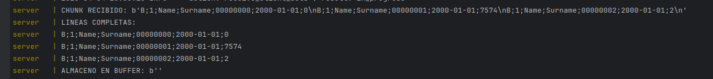
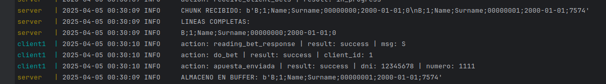
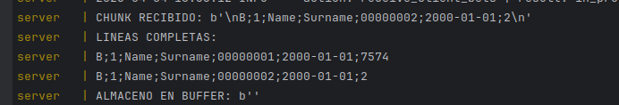
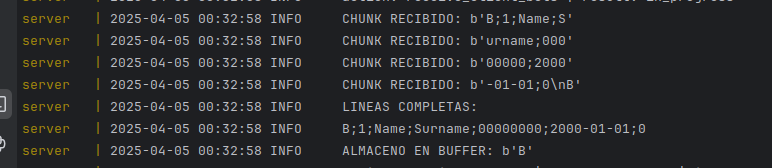
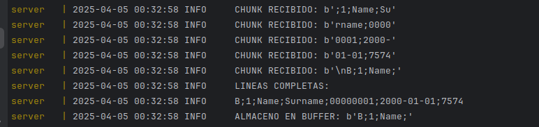
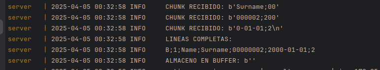

# TP0: Docker + Comunicaciones + Concurrencia

## Reentrega

#### 1. Falta close de client sockets en "happy path" y cuando se ejecuta el SIGTERM

Se agrega el cierre del socket con el cual se esta comunicando en ese momento el servidor, inmediatamente despues de haberle enviado los documentos ganadores del sorteo.
Se agrega a su vez, dentro de exit_gracefully -funcion invocada ante una señal SIGTERM- una iteracion que recorre cada uno de los sockets que se tienen guardados de los clientes conectados y se les hace close a todos ellos.

#### 2. No haces lock para el store_bets en "happy path" AUNQUE lo tenés ahí disponible

Si bien se habia agregado una variable en servidor self._bets_lock y en register_bet se utilizaba en una de las invocaciones a store_bets, 
se agrego tambien el lock para cuando se hace la ultima invocacion al final del bucle ya que alli no se estaba realizando.

#### 3. No manejas correctamente el corte de paquetes con \n en el server: puede ser que leas un paquete y parte del siguiente que va a quedar corrupto (receive_client_bets)

Se edita la logica de la funcion receive_client_bets. Se crea el diccionario self.msg_buffer en donde vamos a ir almacenando para cada cliente, los mensajes que no llegamos a recibir en su totalidad.
Es decir, si leemos 1,2,3\n4 vamos a almacenar unicamente 4 y de esta manera reservarlo para cuando en el futuro llegue el resto de su contenido. Se agregan lineas de log para verificar funcionamiento.

Unicamente para fines de testing se modifica el valor de la cantidad de bytes disponibles para leer del server, y utilizamos el archivo del primer cliente:

_a. 1024 Bytes_

Como se puede observar en la imagen, en este caso solo basta con leer un unico chunk para obtener la totalidad de lineas contenidas en el archivo. Dado que no tenemos excedente el buffer aguarda vacio.

_b. 80 Bytes_

Se hace una primer lectura del chunk el cual solamente llega a procesar en su totalidad a la primer apuesta, dado que de la segunda aun no leyo el valor del \n delimitante para su fin. Computabilizamos la linea leida y guardamos en buffer lo leido de la segunda.

En el siguiente chunk obtenemos el \n de la segunda apuesta, al igual que la totalidad de los datos de la tercera. Basandonos en lo que teniamos guardado previamente en el buffer formamos la segunda apuesta y a su vez tambien guardamos la tercera. Podemos ver que efectivamente se registran 2 apuestas y el buffer luego vuelve a quedar vacio.

_c. 10 Bytes_

Limitamos aun mas la cantidad disponible de lectura haciendo ahora que se tengan que hacer varias iteraciones hasta completar una linea. En este escenario en particular, cuando llegamos a la cuarta cortamos el loop dado que se detecta un \n.

En este caso solo se llego a enviar de mas el identificatorio 'B' que hace referencia el primer campo de la siguiente apuesta, el cual indica que tambien esta sera una 'bet'. Guardamos esto en buffer y computamos primer apuesta.

A continuacion volvemos a recibir chunks. Podemos notar que el chunk inicia con un ';' lo cual tiene sentido porque es el que continuaba el 'B' ya enviado. Esta vez nos llega informacion sobre la segunda apuesta, salvo en el ultimo donde obtenemos varios campos de la tercera ('B;1;Name;'). Junto a lo almacenado en buffer se forma la segunda apuesta la cual queda procesada, y ahora se guardan en buffer los datos de la tercera.

Continuamos registrando los ultimos chunks. El ultimo recibido finaliza en \n con lo cual notamos que el buffer nuevamente queda vacio.

#### 4. Usas threads pero no explicas por qué está bien utilizarlos en este caso de uso para python

Se utilizaron threads en este caso de uso para poder manejar multiples conexiones de clientes sin que nos quede bloqueado el servidor. 
Dada la naturaleza del problema que permite que la cantidad de clientes sea configurable al correr nuestro generar-compose.sh, debemos 
hacerlo extensible a que a su vez cada uno de ellos pueda manejarse de manera independiente. El usar threads permitio la creacion de un 
hilo para cada uno de ellos, lo cual nos garantiza que el servidor pueda antender a varios y manejar estas conexiones de manera concurrente. 
Por el contrario, de otra manera este se bloquearia a la espera de la respuesta del cliente actual.
En mi codigo se tiene un hilo principal que es el encargado de ir aceptando y handleando nuevas conexiones, y luego los hilos secundarios 
son los que van a ir resolviendo las tareas asociadas a su respectivo cliente.

